**你一句春不晚，我就到了真江南**
# 前言
- 感谢`CUC`的五天读书周与五一连在一起放，上学期期末就想去江南玩，但一直没找到人陪我，刚好放假这段时间高一的妹妹要考试，索性让妈妈给她请假出来玩。
- 下面这个表格是原本的安排，但由于飞机提前、苏博没有约上等小差错，所以实际与攻略相差很大

|日期|时间|安排 / 景点|备注 / 建议|住宿|
|---|---|---|---|---|
|4.25|晚上|到上海浦东机场 → 打车前往苏州|建议晚餐在机场简单解决|苏州|
|4.26|9:00 – 12:00|**拙政园**|世界文化遗产，早上拍照光线好||
||12:00 – 13:00|午餐|推荐苏式面、松鼠桂鱼||
||13:00 – 16:00|**平江路历史街区**|古街小桥流水，逛手工店、拍照||
||18:00 – 20:00|**山塘街夜游**|夜景拍照，人少时可以坐乌篷船|苏州|
|4.27|9:00 – 12:00|**苏州博物馆**|贝聿铭设计，了解苏州历史||
||12:00 – 13:00|午餐|苏州本帮菜||
||13:30 – 17:00|**金鸡湖景区**|现代景观 + 拍照||
||18:00 – 20:00|金鸡湖夜景|湖边灯光夜景拍摄|苏州|
|4.28|上午|自由活动 / 小购物|可逛苏州商圈||
||下午|前往**周庄**|车程约1小时|周庄|
||17:00 – 20:00|周庄夜景|小桥流水夜景拍照|周庄|
|4.29|6:30 – 9:00|**周庄晨景**|清晨光线最佳，拍照||
||9:00 – 11:00|周庄 → 杭州|车程约2小时|杭州|
||11:00 – 12:00|酒店入住 / 午餐|河坊街附近||
||13:00 – 17:00|**河坊街**|古街漫步，品小吃||
||18:00 – 20:00|自由活动 / 夜游|可拍河坊街夜景|杭州|
|4.30|7:00 – 9:00|西湖早晨散步（断桥 → 苏堤 → 白堤）|避开假期高峰，晨光好拍照|杭州|
||9:00 – 11:00|花港观鱼 → 曲院风荷|春季花卉、拍照||
||11:00 – 12:00|午餐|湖滨银泰或河坊街小吃||
||12:00 – 15:30|**雷峰塔** / 西湖游船（三潭印月）|建议门票提前预约||
||15:30 – 17:00|湖滨步行街 / 自由活动|可休息或拍傍晚湖景||
||18:00 – 20:00|晚餐 + 自由活动|河坊街或酒店附近|杭州|
|5.1|7:00 – 10:00|**九溪烟树**徒步|早上人少，拍竹林溪水||
||10:00 – 12:00|**龙井村**茶园参观 + 茶艺体验|可采茶、泡茶、拍照||
||12:00 – 13:30|午餐|龙井村附近农家乐，杭帮菜||
||13:30 – 15:00|**云栖竹径**|小众景点，人少，拍竹林和溪流照片|杭州|
||15:00 – 18:00|市区自由活动 / 西湖短途散步|如果体力允许，可顺路拍湖边晚霞||
|5.2|6:30 – 7:00|酒店早餐 + 退房|轻装出发|
||7:00 – 8:00|杭州 → 上海虹桥高铁|提前订票，早班高铁，约1小时到达|
||8:00 – 8:30|上海虹桥站 → 外滩 / 南京东路|打车或地铁约30分钟|
||8:30 – 10:00|**外滩**|黄浦江沿岸拍照，欣赏陆家嘴天际线|
||10:00 – 11:30|**南京东路步行街 / 城隍庙**|逛街买手信，小笼包、生煎、蟹壳黄|
||11:30 – 12:30|午餐|城隍庙附近本帮菜或快餐|
||12:30 – 16:30|**上海市区自由活动** / 购物 / 河边散步|可逛人民广场、淮海路、豫园商城等|
||16:30 – 17:30|回酒店或机场行李取件|预留交通时间|
||17:30 – 18:30|前往浦东机场（或虹桥机场，根据航班）|上海浦东机场约1小时，虹桥约30分钟|
||18:30 – 21:35|办理登机、安检、候机|留足时间登机|
||21:35|飞机起飞|—|

---

# 新的时间线

|日期|时间|安排|住宿|
|---|---|---|---|
|4.25|6:00 - 10:00|从北京出发飞往上海||
||11:00 - 16:00|上海南京路——外滩||
||18:30 - 22:00|苏州七里山塘|苏州|

# 4.25
## ✈
- 首先是上午五点半就起床😧（也是见过凌晨五点的北京的人了），六点坐上前往首都`T3`航站楼的网约车。原本挺担心晕车的，不过运气比较好，叔叔人很好并且车里没有异味，是让人很舒服的香水味。然后是第一次办行李托运，走进看才发现是自助托运。
- 在等待飞机与飞机上赶在`ddl`前写完了概率论作业~~虽然看起来很潦草，实际上也很潦草~~
- 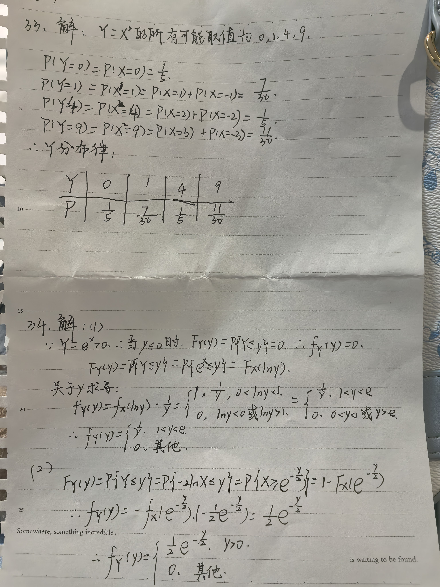
---
## ⬆🌊
- 谁懂我出机场后看见我妹妹穿着云天化校服出门旅游的震惊啊
- 匆匆参考了下B站，打算先在上海见识一下大城市
- **南京路步行街——外滩**
	- 逛了**大白兔**、名创优品壹号店还有些别的，走了很久终于到了外滩，因为走不动了就没有坐船过河，拍了几张外滩风景就去苏州了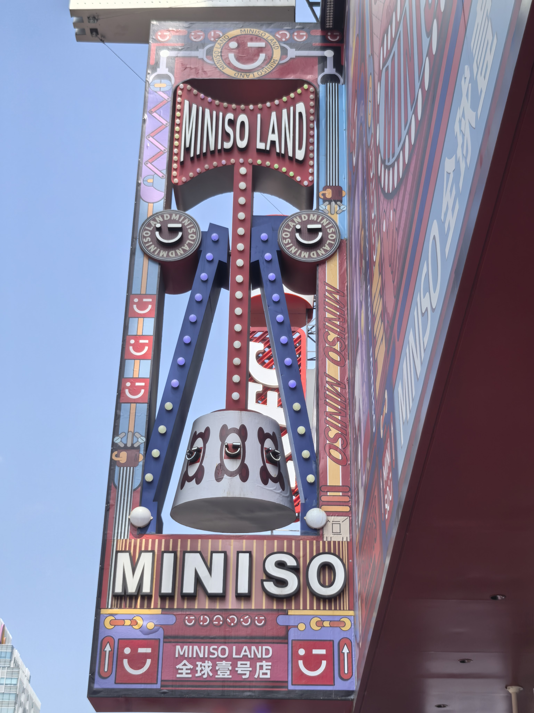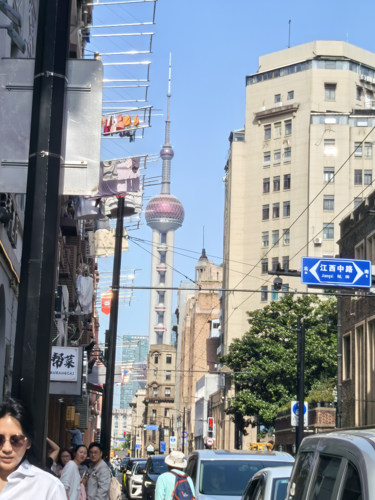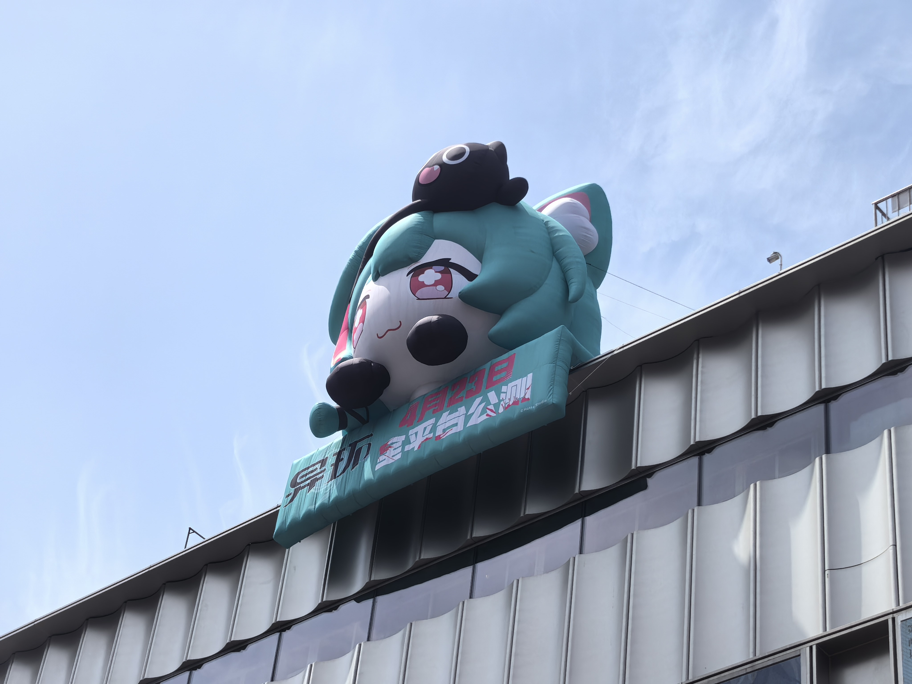
	- 一位很漂亮的`coser`，原相机都这么美😍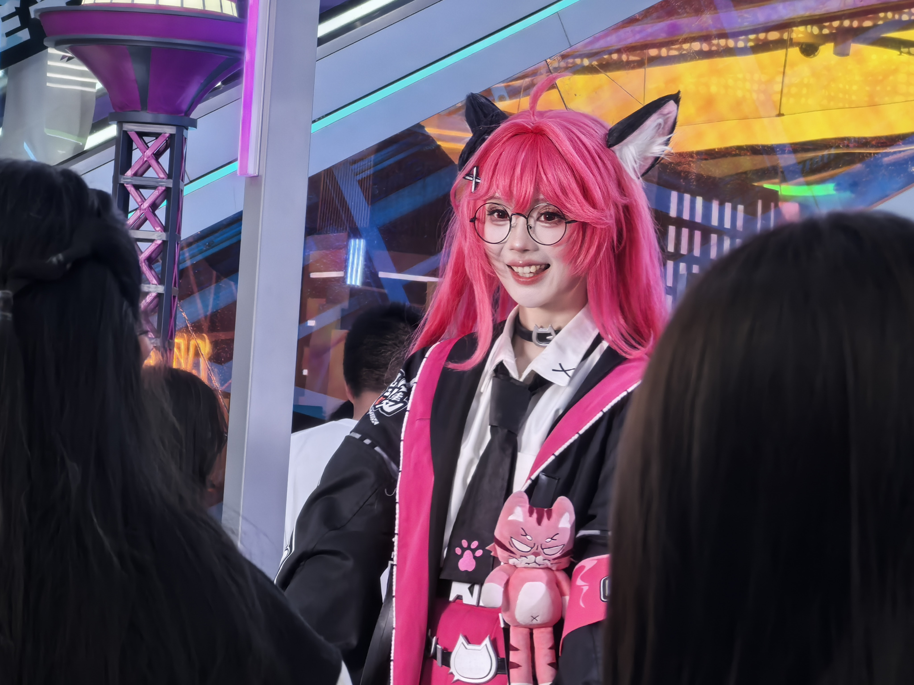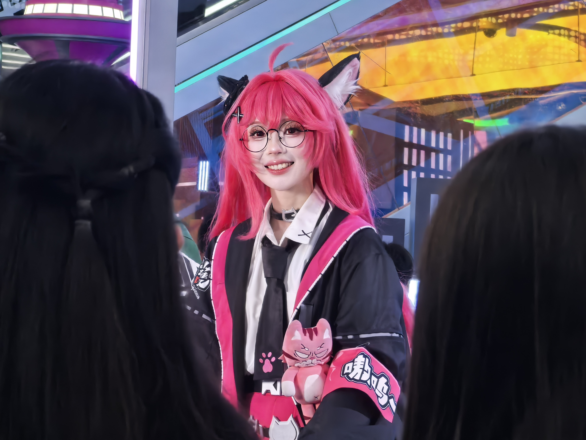
---
## 苏州——七里山塘
- 下午六点到达苏州，放完行李后前往七里山塘附近吃晚饭——苏式火锅，但我还是更喜欢四川的火锅😄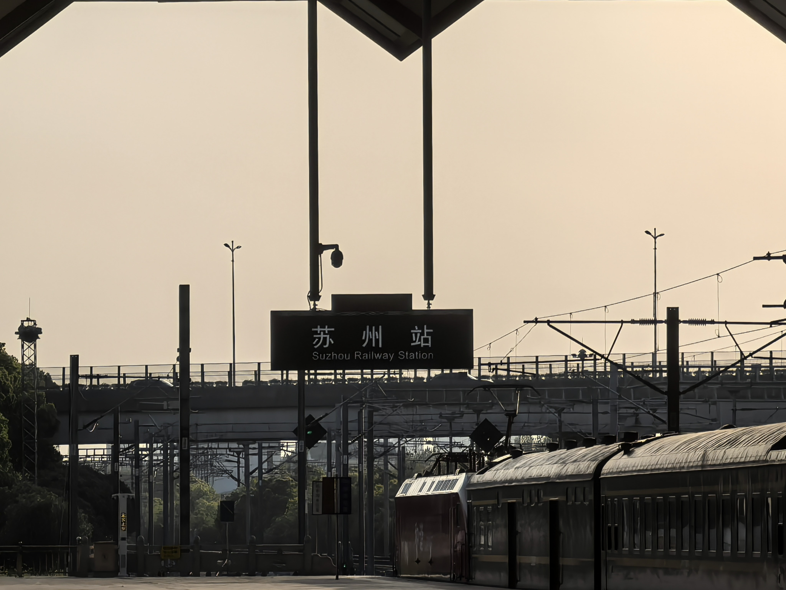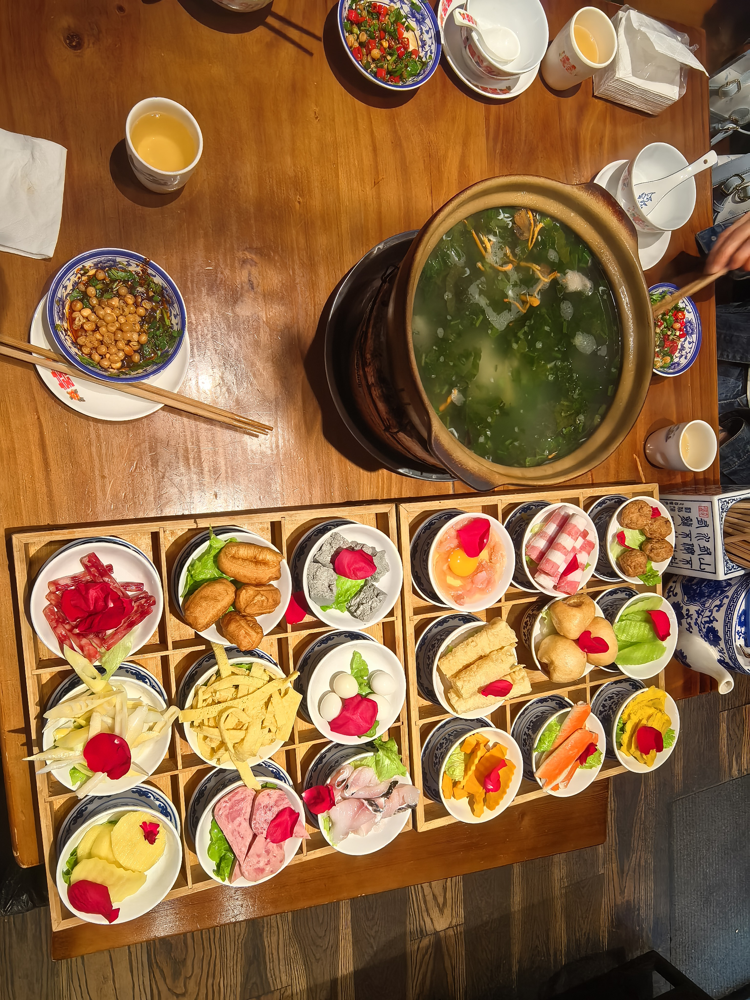
- 地区差异还是挺大的，我记得老家那边的火锅汤底是端来就已经很香了，但苏州的、北京的好多是用白开水或者吃到最后那个汤才好喝😭，想回家了
- 吃完就在那里逛**七里山塘**，走了半天才发现还没有进山塘街。苏州的特色真的很明显——走三步问你买不买茉莉花手串，走五步问你拍不拍照，走十步问你做不做妆造、穿不穿旗袍。妹妹花了45买了杯茉莉花奶茶，真材实料，不过喝起来和伯牙绝弦差不多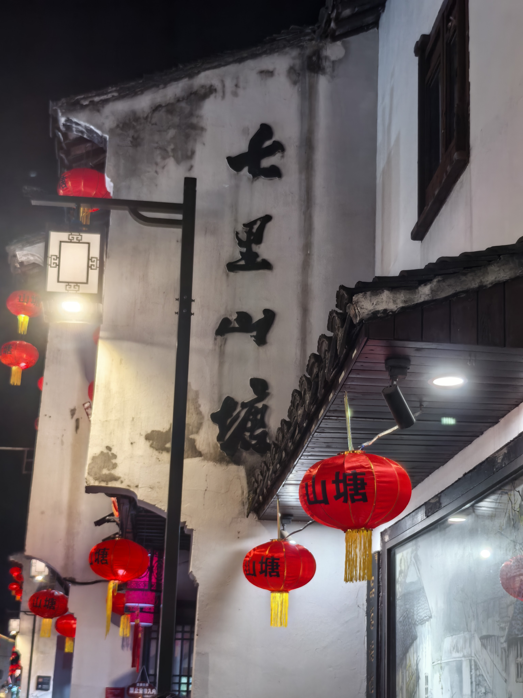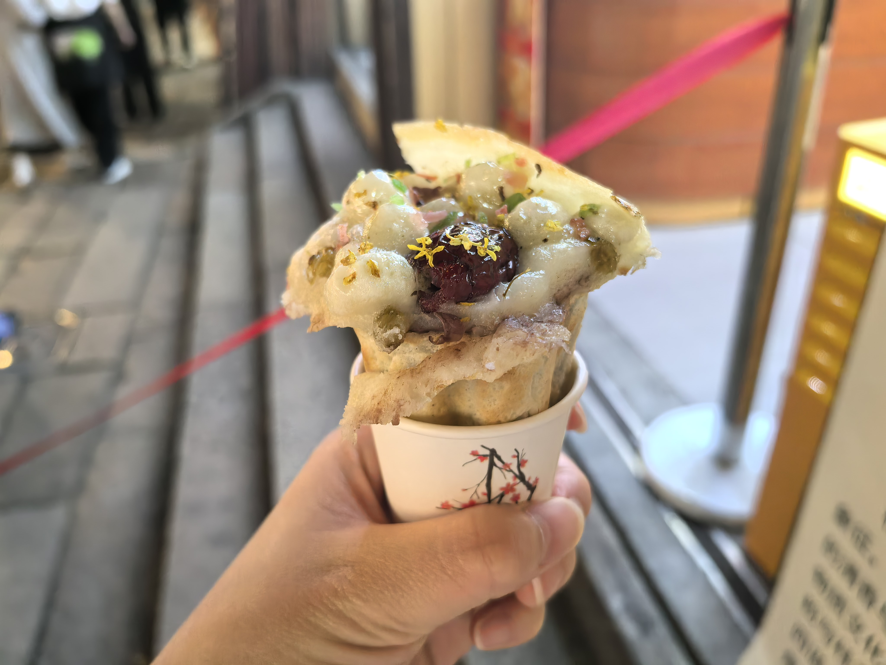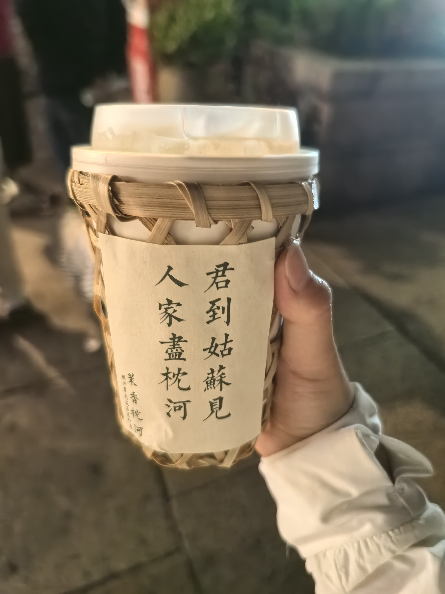
- 山塘街的夜景，一种很标准的想象中的江南夜景。老家也在江边，但那条金沙江有点宽，没有“小桥流水人家”的小巧的感觉，是“大河向东流啊，天上的星星参北斗啊”（《好汉歌》）的豪放~~？应该是这样形容的，请原谅我文笔不太好😅~~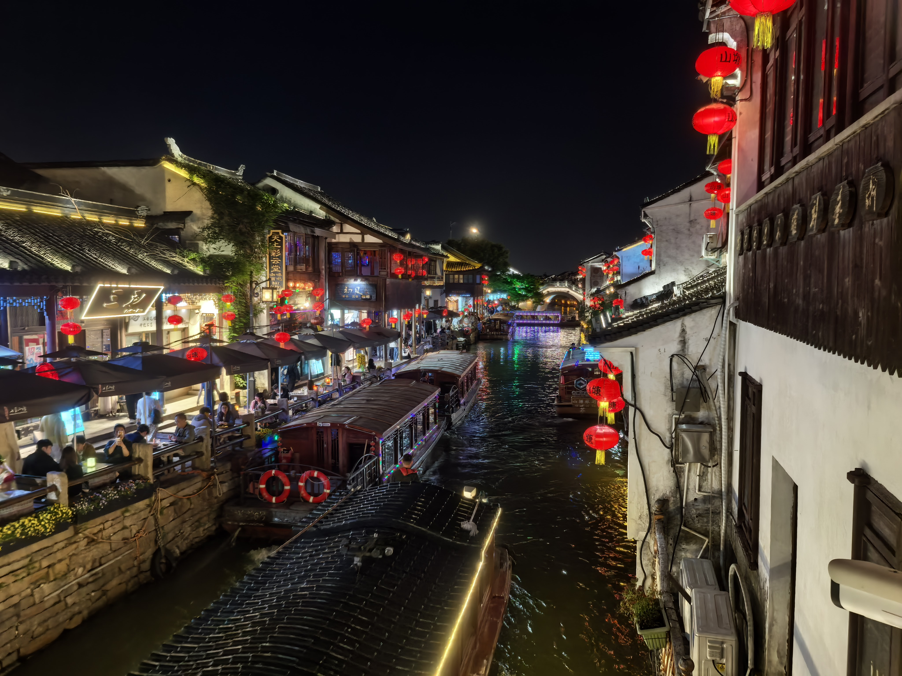